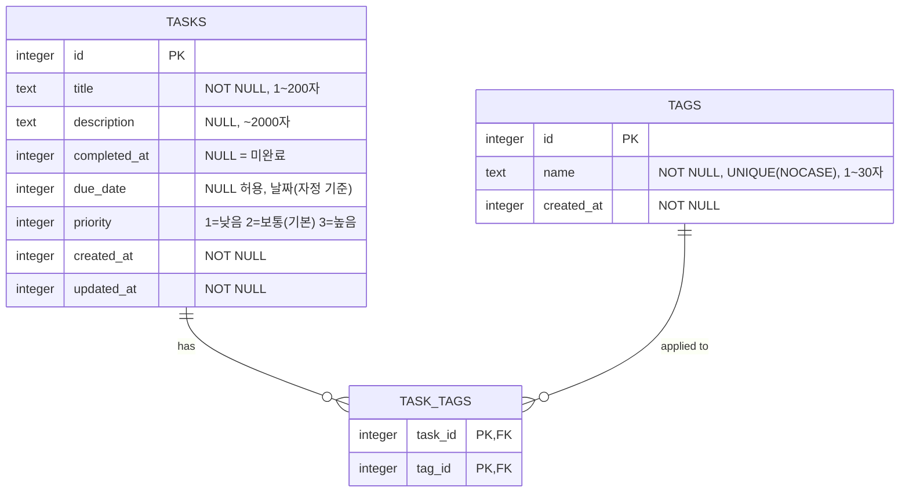

# TODO App — 데이터 모델 (ERD)

| 항목 | 내용 |
|---|---|
| 문서 버전 | 1.1 |
| 작성일 · 최종 수정 | 2026-08-04 |
| 대상 DB | SQLite (파일 기반) |
| 접근 계층 | Drizzle ORM 0.45 + better-sqlite3 13 |
| 구현 경로 | `src/lib/server/db/` (스키마·커넥션·마이그레이션), `src/lib/server/store.ts` (쿼리) |
| 관련 문서 | [PRD.md](PRD.md), [SCREENS.md](SCREENS.md) |

**변경 이력**

| 버전 | 일자 | 변경 내용 |
|---|---|---|
| 1.0 | 2026-08-04 | 최초 작성 |
| 1.1 | 2026-08-04 | 구현 결과 반영: 인덱스 방향 지정(§2.1), COLLATE NOCASE → lower() 표현식 인덱스(§2.2), better-sqlite3 기본값 정정(§4), 백업 절차 신설(§7) |

---

## 1. 엔티티 관계도



**관계 요약**

| 관계 | 카디널리티 | 설명 |
|---|---|---|
| TASKS ↔ TAGS | N : M | 하나의 할 일에 여러 태그, 하나의 태그가 여러 할 일에 (FR-401) |
| TASKS → TASK_TAGS | 1 : 0..N | 할 일 삭제 시 연결 CASCADE 삭제 (FR-109) |
| TAGS → TASK_TAGS | 1 : 0..N | 태그 삭제 시 연결만 CASCADE 삭제, 할 일은 유지 (FR-404) |

> `users` 테이블은 없다. 단일 사용자 전제(PRD 가정 A1)의 직접적 결과이며, 다중 사용자로 전환하면 §7의 변경이 필요하다.

---

## 2. 테이블 정의

### 2.1 `tasks` — 할 일

| 컬럼 | 타입 | 제약 | 기본값 | 설명 |
|---|---|---|---|---|
| `id` | INTEGER | PK, AUTOINCREMENT | — | 대리 키 |
| `title` | TEXT | NOT NULL, `length(trim(title)) BETWEEN 1 AND 200` | — | 할 일 제목 (FR-102, FR-103) |
| `description` | TEXT | NULL, `length(description) <= 2000` | NULL | 상세 설명 (FR-103) |
| `completed_at` | INTEGER | NULL | NULL | 완료 시각(Unix 초). **NULL = 미완료** (FR-107) |
| `due_date` | INTEGER | NULL | NULL | 마감일. 해당 날짜 로컬 자정의 Unix 초 (FR-201) |
| `priority` | INTEGER | NOT NULL, `IN (1,2,3)` | 2 | 1=낮음, 2=보통, 3=높음 (FR-301) |
| `created_at` | INTEGER | NOT NULL | 현재 시각 | 생성 시각 |
| `updated_at` | INTEGER | NOT NULL | 현재 시각 | 마지막 수정 시각 (FR-106) |

**인덱스**

| 인덱스 | 컬럼 | 목적 |
|---|---|---|
| `idx_tasks_completed_at` | `completed_at` | 상태 필터 (FR-503), 요약 건수 집계의 커버링 인덱스 |
| `idx_tasks_due_priority` | `due_date ASC`, `priority DESC` | 기본 정렬 (FR-502, NFR-104). 선두 컬럼으로 마감일 필터(FR-505)도 커버 |
| `idx_tasks_priority_due` | `priority DESC`, `due_date ASC` | 우선순위 정렬 (FR-501) |

**인덱스 방향이 중요하다.** `ORDER BY due_date ASC, priority DESC`는 인덱스 방향이 정확히 같아야
인덱스 순서를 그대로 쓴다. 방향이 어긋나면 SQLite가 `USE TEMP B-TREE FOR ORDER BY`로 다시 정렬한다.
1,000행 실측에서 방향을 맞춘 뒤 기본 정렬의 임시 정렬이 사라졌다.

`due_date` 단일 인덱스는 두지 않는다. `idx_tasks_due_priority`의 선두 컬럼이 같은 역할을 하므로
중복이고, 쓰기 때마다 갱신 비용만 늘어난다.

### 2.2 `tags` — 태그

| 컬럼 | 타입 | 제약 | 기본값 | 설명 |
|---|---|---|---|---|
| `id` | INTEGER | PK, AUTOINCREMENT | — | 대리 키 |
| `name` | TEXT | NOT NULL, `length(trim(name)) BETWEEN 1 AND 30` | — | 태그 이름 (FR-402, FR-403) |
| `created_at` | INTEGER | NOT NULL | 현재 시각 | 생성 시각 |

**인덱스**

| 인덱스 | 대상 | 목적 |
|---|---|---|
| `idx_tags_name_nocase` | UNIQUE `lower(name)` | 대소문자 무시 중복 거부 (FR-402) |

> "대소문자를 무시한 중복 거부"(FR-402)를 **DB 레벨에서** 보장한다. 애플리케이션 검사에만 의존하지 않는다.
>
> 컬럼에 `COLLATE NOCASE`를 붙이는 대신 `lower(name)` **표현식 유니크 인덱스**를 쓴다.
> drizzle-kit이 `COLLATE NOCASE`를 생성해주지 않아 마이그레이션 SQL을 손으로 고쳐야 하는데,
> 그러면 스키마 정의와 마이그레이션이 어긋나 다음 `generate`가 인덱스를 되돌린다.
> 표현식 인덱스는 스키마에 선언 가능해서 이 드리프트가 없다.
>
> 실측: `INSERT 'ZZTest'` 후 `INSERT 'zztest'` → `UNIQUE constraint failed: index 'idx_tags_name_nocase'`.

### 2.3 `task_tags` — 할 일-태그 연결

| 컬럼 | 타입 | 제약 | 설명 |
|---|---|---|---|
| `task_id` | INTEGER | NOT NULL, FK → `tasks(id)` ON DELETE CASCADE | |
| `tag_id` | INTEGER | NOT NULL, FK → `tags(id)` ON DELETE CASCADE | |
| — | — | PRIMARY KEY (`task_id`, `tag_id`) | 동일 태그 중복 연결 방지 |

**인덱스**

| 인덱스 | 컬럼 | 목적 |
|---|---|---|
| (복합 PK) | `task_id`, `tag_id` | 할 일 기준 태그 조회 |
| `idx_task_tags_tag_id` | `tag_id` | 태그 기준 할 일 조회 = 태그 필터 (FR-504) |

> 복합 PK는 `task_id`가 선행이므로 `tag_id` 단독 조회를 커버하지 못한다. 태그 필터 성능을 위해 `idx_task_tags_tag_id`가 **별도로 필요**하다.

---

## 3. 설계 결정 및 트레이드오프

### 3.1 완료 상태를 `completed_at` 단일 컬럼으로 표현
- **결정**: `status` 열거형 컬럼을 두지 않고 `completed_at IS NULL`로 미완료를 판정한다.
- **근거**: 완료 여부와 완료 시각을 한 컬럼이 담아 두 컬럼 간 불일치(`status='done'` 인데 `completed_at IS NULL`) 상태가 **구조적으로 발생할 수 없다**.
- **대가**: 쿼리에 `WHERE completed_at IS NULL`이 반복 등장한다. 조회 함수로 감싸 해결한다.

### 3.2 우선순위를 INTEGER(1/2/3)로 저장
- **결정**: TEXT(`'high'|'medium'|'low'`)가 아니라 INTEGER.
- **근거**: TEXT는 알파벳 정렬이 `high < low < medium`으로 의미와 어긋나 정렬에 CASE 식이 필요하다. INTEGER는 `ORDER BY priority DESC`가 그대로 "높음 우선"이 된다(FR-502).
- **대가**: 숫자 자체는 의미가 드러나지 않아 코드에 상수 매핑이 필요하다.

### 3.3 마감일을 날짜 단위 INTEGER로 저장
- **결정**: 해당 날짜 **로컬 자정의 Unix 초**를 저장한다 (PRD 가정 A4).
- **근거**: `<input type="date">` 입력과 1:1 대응되고, "오늘/이번 주/지남" 필터가 정수 비교로 끝난다.
- **대가**: 타임존이 다른 환경에서 DB 파일을 열면 날짜가 하루 밀릴 수 있다. 단일 사용자·단일 호스트 전제(A2)에서 수용한다. 시각 단위 마감이 필요해지면 저장 형식을 재검토한다.

### 3.4 정수 대리 키(AUTOINCREMENT)
- **결정**: nanoid/UUID가 아니라 INTEGER AUTOINCREMENT.
- **근거**: 단일 노드·단일 사용자이므로 분산 ID 생성이 불필요하고, 인덱스 크기와 조인 비용이 작다. URL(`/tasks/3`)도 짧다.
- **대가**: ID가 순차 노출되어 총 건수를 추측할 수 있다. 인증 없는 개인용 로컬 앱이므로 위협이 아니다. 공개 배포 시(향후 F-1) 재검토한다.

### 3.5 태그를 별도 테이블로 분리 (JSON 배열 아님)
- **결정**: `tasks.tags`를 JSON 컬럼으로 두지 않고 `tags` + `task_tags`로 정규화한다.
- **근거**: 태그 필터(FR-504)가 인덱스로 처리되고, 태그 이름 중복 방지(FR-402)와 태그 삭제 시 참조 정리(FR-404)를 DB가 보장한다.
- **대가**: 테이블 2개와 조인이 추가된다. Drizzle 관계 쿼리(`with`)가 단일 SQL로 컴파일해 비용을 흡수한다.

---

## 4. 커넥션 초기화 (필수)

모든 커넥션에서 아래 PRAGMA를 **연결 직후 첫 문장으로** 실행한다 (NFR-201).

```sql
PRAGMA journal_mode = WAL;     -- 다중 읽기 + 단일 쓰기 동시성
PRAGMA synchronous = NORMAL;   -- WAL과 조합 시 안전성/성능 균형
PRAGMA foreign_keys = ON;      -- CASCADE 및 참조 무결성 활성
PRAGMA busy_timeout = 5000;    -- 쓰기 락 대기 5초, SQLITE_BUSY 회피
```

`journal_mode`는 DB 파일에 영구 기록되지만, 나머지 3개는 커넥션 단위 설정이라 매번 실행해야 한다.

**드라이버 기본값 (실측):** better-sqlite3 13은 `foreign_keys=ON`, `synchronous=NORMAL(1)`,
`busy_timeout=5000`을 **이미 기본으로 켠다.** 아무 PRAGMA도 설정하지 않은 커넥션과 위 4개를 모두
설정한 커넥션의 조회 결과가 동일했다. 따라서 현재 드라이버에서 위 호출은 중복이다.

그래도 명시적으로 실행한다:
- 요구사항(NFR-201)이 코드에 드러난다
- 드라이버를 libsql로 바꾸거나 기본값이 달라져도 동작이 변하지 않는다
- **raw SQLite에서 `foreign_keys`는 커넥션마다 기본 OFF다.** 이 경우 `ON DELETE CASCADE`가
  조용히 동작하지 않아 `task_tags`에 고아 행이 쌓인다 (NFR-202 위반)

실측 검증: 할 일 삭제 시 `task_tags`가 6 → 4로 함께 줄고 고아 행 0건,
`PRAGMA foreign_key_check` 결과도 빈 배열이었다.

---

## 5. Drizzle 스키마 매핑

`src/lib/server/db/schema.ts` (NFR-501: 반드시 `$lib/server/` 하위)

| DB 컬럼 타입 | Drizzle 정의 | 비고 |
|---|---|---|
| `INTEGER` (PK) | `integer('id').primaryKey({ autoIncrement: true })` | |
| `TEXT` | `text('title').notNull()` | |
| `INTEGER` (시각) | `integer('created_at', { mode: 'timestamp' })` | Unix **초** 저장, JS `Date`로 변환 |
| `INTEGER` (마감일) | `integer('due_date', { mode: 'timestamp' })` | 날짜 자정 값 (§3.3) |
| CHECK 제약 | `sqliteTable(..., (t) => [check(...)])` | 앱 검증(FR-102)과 **이중 방어** |
| 대소문자 무시 UNIQUE | `uniqueIndex('...').on(sql\`lower(${t.name})\`)` | 표현식 인덱스. `COLLATE NOCASE`는 drizzle-kit이 생성하지 않는다 (§2.2) |
| 인덱스 정렬 방향 | `index('...').on(sql\`${t.dueDate} asc\`, sql\`${t.priority} desc\`)` | Drizzle 0.45의 sqlite 인덱스 빌더에는 `.asc()/.desc()`가 **없다**. `sql`로 지정한다 |
| 복합 PK | `primaryKey({ columns: [t.taskId, t.tagId] })` | |
| FK CASCADE | `.references(() => tasks.id, { onDelete: 'cascade' })` | |

**주의: raw `sql` 템플릿에 `Date`를 바인딩하면 안 된다.** better-sqlite3는 숫자·문자열·bigint·buffer·null만
바인딩할 수 있다. `mode: 'timestamp'` 컬럼과 `Date`를 비교할 때는 반드시 Drizzle 연산자
(`eq`, `lt`, `gte`, `lte`)를 써야 변환이 적용된다.

타입은 스키마에서 파생한다 (NFR-602): `typeof tasks.$inferSelect`, `typeof tasks.$inferInsert`. 별도 인터페이스를 수동 정의하지 않는다.

관계 쿼리를 쓰려면 클라이언트 생성 시 스키마를 전달해야 한다: `drizzle(sqlite, { schema })`.

---

## 6. 마이그레이션 정책

| 명령 | 용도 | 운영 사용 |
|---|---|---|
| `db:generate` | 스키마 변경 → SQL 마이그레이션 파일 생성 | ✅ 필수 |
| `db:migrate` | 마이그레이션 파일 적용 | ✅ 필수 |
| `db:push` | 파일 없이 DB 직접 변형 | ❌ **로컬 탐색용 한정** |
| `db:studio` | DB 브라우저 | 개발 편의 |
| `db:seed` | 데모 데이터 삽입 (할 일이 이미 있으면 건너뜀) | 개발 편의 |
| `db:backup` | 백업 파일 생성 (§7) | ✅ |

- 마이그레이션 파일은 저장소에 커밋한다 (FR-603, US-602).
- `drizzle.config.ts`는 SvelteKit 런타임 밖에서 실행되므로 `$env/static/private`가 아니라 `process.env`를 읽는다.
- DB 파일 경로는 `.env`의 `DB_URL`로 주입한다 (FR-602). DB 파일과 `.env`는 `.gitignore`에 넣는다 (NFR-505).
- **`drizzle-kit`은 DB 파일의 상위 디렉터리를 만들어주지 않는다.** 없으면
  `Cannot open database because the directory does not exist`로 실패한다. 클린 클론에서
  `db:migrate`가 바로 되도록 `data/.gitkeep`을 커밋해 디렉터리를 유지한다 (NFR-604, AC-7).
  앱 런타임에서는 `client.ts`가 `mkdirSync`로 직접 만든다.
- 시드·백업 스크립트는 SvelteKit 런타임 밖에서 돌기 때문에 `$env/static/private`를 쓸 수 없어
  `dotenv` + `process.env`로 `DB_URL`을 읽는다.

---

## 7. 백업 · 복원 (FT-603, NFR-204)

**`todo.db` 파일만 복사하면 안 된다.** WAL 모드에서는 최근 커밋이 `-wal` 파일에만 있을 수 있다.

실측: 커넥션이 열려 WAL이 살아있는 상태에서 1건을 커밋한 뒤
- `todo.db`만 복사한 백업 → **7건** (마지막 커밋 유실)
- `todo.db` + `-wal` + `-shm`을 함께 복사한 백업 → 8건
- `VACUUM INTO`로 만든 백업 → 8건

**권장 절차** (`npm run db:backup`):

```sql
VACUUM INTO '/경로/todo-<타임스탬프>.db';
```

- WAL 내용까지 반영한 **단일 파일**을 만들고 조각화도 정리한다
- 앱을 멈추지 않아도 안전하다
- 대상 파일이 이미 있으면 실패한다 — 덮어쓰기 사고를 막아준다

**복원**: 백업 파일을 `DB_URL` 경로로 복사한다. 이때 기존 `-wal`·`-shm` 파일은 함께 삭제해야
낡은 WAL이 복원한 DB에 다시 적용되지 않는다.

---

## 8. 다중 사용자 전환 시 변경 (향후 F-1)

지금 구현하지 않되, 전환 비용을 미리 기록한다.

1. `users`, `sessions` 테이블 추가 (Better Auth 스키마 기준)
2. `tasks.user_id`, `tags.user_id` FK 추가 (NOT NULL)
3. 기존 행에 소유자를 채우는 데이터 마이그레이션 필요
4. `idx_tags_name_nocase`를 `UNIQUE(user_id, lower(name))` 복합 인덱스로 변경
5. **모든 조회·수정 쿼리에 소유자 조건 추가** — 누락 시 데이터 유출. 가장 위험한 변경
6. 인덱스에 `user_id` 선행 컬럼 추가

> 5번 때문에 전환은 "테이블 추가"가 아니라 **모든 쿼리 재검토**다. PRD 가정 A1이 흔들릴 가능성이 있다면 지금 F-1을 스코프에 넣는 편이 총비용이 낮다.

---

## 9. 참고 자료

- [Drizzle ORM — SQLite](https://orm.drizzle.team/docs/sqlite/get-started-sqlite)
- [SvelteKit with SQLite and Drizzle — Full Stack SvelteKit](https://fullstacksveltekit.com/blog/sveltekit-sqlite-drizzle)
- [Gotchas with SQLite in Production — Anže Pečar](https://blog.pecar.me/sqlite-prod/)
- [How to Set Up SQLite for Production Use — OneUptime](https://oneuptime.com/blog/post/2026-02-02-sqlite-production-setup/view)
- [SQLite WAL Mode and Concurrency — Coddy](https://coddy.tech/docs/sqlite/wal-mode-and-concurrency)
