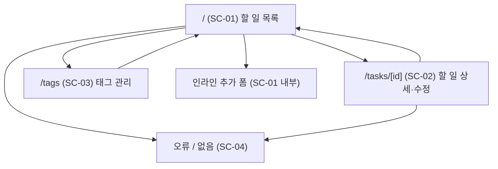

# TODO App — 화면설계서

| 항목 | 내용 |
|---|---|
| 문서 버전 | 1.1 |
| 작성일 | 2026-08-04 |
| 최종 수정 | 2026-08-04 |
| 문서 유형 | 화면정의서 / 와이어프레임 (저충실도) |
| 관련 문서 | [PRD.md](PRD.md), [ERD.md](ERD.md) |
| 구현 경로 | `src/routes/` (데이터는 `src/lib/server/store.ts` 인메모리 목 데이터) |

문서 구성은 일반적인 화면설계서 관례를 따른다: **표지 → 버전 관리 → IA → 화면설계서 → 시나리오 → 기타 사항**.
와이어프레임은 디자인을 걷어낸 구조만 표현한다. 색·폰트·여백은 이 문서의 대상이 아니다.

---

## 1. 버전 관리

| 버전 | 일자 | 변경 내용 | 작성자 |
|---|---|---|---|
| 1.0 | 2026-08-04 | 최초 작성 (SC-01 ~ SC-04) | — |
| 1.1 | 2026-08-04 | SvelteKit 구현 결과 반영: ⑫ 완료 토글을 토글 버튼으로 확정, 삭제 확인을 서버 왕복 2단계로 통일 | — |

---

## 2. IA (정보 구조도)

이 문서의 목차 역할을 한다. 각 화면의 기능 범위와 진입 경로를 한눈에 파악하기 위한 장이다.



| 화면 ID | 화면명 | 경로 | 유형 | 관련 에픽 |
|---|---|---|---|---|
| SC-01 | 할 일 목록 | `/` | 메인 | EP-01, EP-02, EP-03, EP-05 |
| SC-02 | 할 일 상세·수정 | `/tasks/[id]` | 상세 | EP-01, EP-02, EP-03, EP-04 |
| SC-03 | 태그 관리 | `/tags` | 관리 | EP-04 |
| SC-04 | 오류 / 없음 | 전역 | 시스템 | — |

**전역 레이아웃 (`+layout.svelte`)**: 헤더(앱 이름 + 「할 일」/「태그」 내비게이션)와 본문 영역. 푸터 없음.

---

## 3. 화면설계서

### SC-01. 할 일 목록

- **경로**: `/`
- **진입점**: 앱 최초 진입, 헤더 「할 일」, SC-02·SC-03에서 저장/취소 후
- **목적**: 할 일 조회·추가·완료·삭제를 한 화면에서 처리 (P-1의 "3초 안에 추가" 목표 달성 지점)

#### 와이어프레임

```
┌──────────────────────────────────────────────────────────────┐
│ TODO                                     [할 일]  [태그]      │  ← 전역 헤더
├──────────────────────────────────────────────────────────────┤
│ ┌────────────────────────────────────────────────┬─────────┐ │
│ │ ①  할 일을 입력하세요                            │ ② 추가  │ │  ← 추가 폼
│ └────────────────────────────────────────────────┴─────────┘ │
│   ⚠ 제목을 입력하세요                                          │  ← ③ 오류 (조건부)
├──────────────────────────────────────────────────────────────┤
│ ④상태: [전체 ▾]  ⑤태그: [전체 ▾]  ⑥마감: [전체 ▾]            │
│ ⑦정렬: [마감일 ▾]  ⑧[ 검색어           ]  ⑨[적용] ⑩[초기화]  │  ← 필터 바 (GET form)
├──────────────────────────────────────────────────────────────┤
│ 미완료 4건 · 완료 2건                                          │  ← ⑪ 요약
├──────────────────────────────────────────────────────────────┤
│ ⑫□ │ ⑬발표자료 초안 작성                                      │
│    │ ⑭[지남] 2026-08-01  ⑮높음  ⑯#업무 #긴급      ⑰[삭제]     │  ← 항목 행
├──────────────────────────────────────────────────────────────┤
│  □ │ 병원 예약 전화                                            │
│    │ [오늘] 2026-08-04  보통  #개인                 [삭제]     │
├──────────────────────────────────────────────────────────────┤
│  □ │ 책 반납                                                   │
│    │ 2026-08-09  낮음                               [삭제]     │
├──────────────────────────────────────────────────────────────┤
│  ☑ │ ~~장바구니 정리~~                                         │
│    │ 완료 2026-08-03  보통  #개인                   [삭제]     │
└──────────────────────────────────────────────────────────────┘
```

#### 구성 요소 정의

| No | 명칭 | 타입 | 동작 / 검증 | 관련 FR |
|---|---|---|---|---|
| ① | 제목 입력 | text input | 필수, trim 후 1~200자. Enter로 제출 | FR-101, FR-102, FR-103 |
| ② | 추가 버튼 | submit (`?/create`) | 성공 시 목록 갱신, ① 비우고 포커스 유지 | FR-101 |
| ③ | 추가 오류 | 텍스트 | 검증 실패 시 표시. 입력값 유지 | FR-102, NFR-403 |
| ④ | 상태 필터 | select | 전체 / 미완료 / 완료 (기본: 전체) | FR-503 |
| ⑤ | 태그 필터 | select | 전체 + 등록된 태그 목록 (단일 선택) | FR-504 |
| ⑥ | 마감 필터 | select | 전체 / 오늘 / 이번 주 / 마감 지남 | FR-505 |
| ⑦ | 정렬 | select | 마감일 / 우선순위 / 생성일 (기본: 마감일) | FR-501, FR-502 |
| ⑧ | 검색 | search input | 제목·설명 부분 일치, 대소문자 무시 | FR-507 |
| ⑨ | 적용 | submit (GET) | 쿼리 파라미터로 `/` 재요청 | FR-508 |
| ⑩ | 초기화 | link → `/` | 모든 필터·검색 해제 | FR-509 |
| ⑪ | 결과 요약 | 텍스트 | 현재 조건의 미완료/완료 건수 | — |
| ⑫ | 완료 토글 버튼 | submit (`?/toggle`) | 즉시 토글. 필터·정렬 조건 유지. 미완료 `☐` / 완료 `☑` 표시 | FR-107 |
| ⑬ | 제목 | link → SC-02 | 완료 항목은 취소선 | FR-104 |
| ⑭ | 마감일 + 상태 라벨 | 텍스트 | 미완료 & 마감 < 오늘 → `[지남]`, = 오늘 → `[오늘]`. 색상 단독 사용 금지 | FR-202, FR-203, NFR-304 |
| ⑮ | 우선순위 | 텍스트 | 높음 / 보통 / 낮음 | FR-301 |
| ⑯ | 태그 | 텍스트(링크) | 클릭 시 해당 태그로 ⑤ 필터 적용 | FR-401, FR-504 |
| ⑰ | 삭제 | submit (`?/delete`) | 1차 제출 → 확인 패널 표시, 2차 제출(`confirmed`)에서만 실제 삭제 | FR-108 |

#### 화면 상태

| 상태 | 조건 | 표시 |
|---|---|---|
| 기본 | 할 일 1건 이상 | 목록 표시 |
| 빈 상태 (전체) | 등록된 할 일 0건 | "첫 할 일을 추가해 보세요" + ①로 포커스 유도 |
| 빈 상태 (필터) | 필터 결과 0건 | "조건에 맞는 할 일이 없습니다" + ⑩ 초기화 링크 |
| 검증 오류 | 제목 검증 실패 | ③ 표시, 입력값 유지 |
| 삭제 확인 | ⑰ 1차 제출 직후 | 목록 위에 확인 패널 표시. 「삭제 확인」/「취소」 제공, 목록은 그대로 유지 |

#### 상호작용 규칙

- ④~⑧은 `<form method="GET">`으로 감싼다. JS 없이도 필터가 동작한다 (NFR-402).
- ⑫·⑰은 각각 독립 `<form method="POST">`이며, form action에 현재 쿼리 문자열을 함께 실어 조작 후에도 조건이 유지된다 (US-104 수용 기준 3).
  `action="?/toggle"`만 쓰면 기존 쿼리 파라미터가 날아가 필터가 초기화된다.
- JS가 있으면 `use:enhance`로 전체 리로드 없이 처리한다 (NFR-401).
- **⑫ 완료 토글은 체크박스가 아니라 토글 버튼으로 구현한다.** 체크박스는 클릭만으로 폼을 제출하지 못해
  JS가 필요하고, 이는 NFR-401과 충돌한다. `aria-pressed`로 완료 여부를 전달하고 `☐`/`☑`를 표시한다.
- **⑰ 삭제 확인은 서버 왕복 2단계로 구현한다.** JS 전용 확인 다이얼로그를 쓰지 않으므로 JS 유무와 무관하게
  같은 경로로 동작하고 분기가 없다 (FR-108, NFR-401).

---

### SC-02. 할 일 상세·수정

- **경로**: `/tasks/[id]`
- **진입점**: SC-01의 ⑬ 제목 클릭
- **목적**: 목록에서 다루지 않는 속성(설명, 마감일, 우선순위, 태그)을 편집

#### 와이어프레임

```
┌──────────────────────────────────────────────────────────────┐
│ TODO                                     [할 일]  [태그]      │
├──────────────────────────────────────────────────────────────┤
│ ① ← 목록으로                                                  │
├──────────────────────────────────────────────────────────────┤
│ 제목 *                                                        │
│ ┌──────────────────────────────────────────────────────────┐ │
│ │ ② 발표자료 초안 작성                                       │ │
│ └──────────────────────────────────────────────────────────┘ │
│                                                               │
│ 설명                                                          │
│ ┌──────────────────────────────────────────────────────────┐ │
│ │ ③                                                        │ │
│ │                                                          │ │
│ └──────────────────────────────────────────────────────────┘ │
│                                                               │
│ 마감일              우선순위                                   │
│ ┌──────────────┐   ┌──────────────┐                          │
│ │ ④ 2026-08-01 │   │ ⑤ 높음     ▾ │                          │
│ └──────────────┘   └──────────────┘                          │
│                                                               │
│ 태그                                                          │
│ ⑥ ☑ 업무   ☑ 긴급   ☐ 개인   ☐ 공부      ⑦ 태그 관리 →       │
│                                                               │
│ ⑧ ☑ 완료   (완료: 2026-08-03)                                │
│                                                               │
│ ⑨[저장]  ⑩[취소]                              ⑪[삭제]        │
│                                                               │
│ 생성 2026-07-28 · 수정 2026-08-02                             │  ← ⑫
└──────────────────────────────────────────────────────────────┘
```

#### 구성 요소 정의

| No | 명칭 | 타입 | 동작 / 검증 | 관련 FR |
|---|---|---|---|---|
| ① | 목록으로 | link → `/` | SC-01에서 넘겨준 `from` 파라미터의 조회 조건으로 복귀 | — |
| ② | 제목 | text input | 필수, trim 후 1~200자 | FR-102, FR-103, FR-105 |
| ③ | 설명 | textarea | 선택, 최대 2,000자 | FR-103, FR-105 |
| ④ | 마감일 | `input[type=date]` | 선택. 비우면 마감일 해제. 과거 날짜 허용 | FR-201 |
| ⑤ | 우선순위 | select | 높음 / 보통 / 낮음 (기본: 보통) | FR-301 |
| ⑥ | 태그 선택 | checkbox group | 등록된 태그 다중 선택. 0개 허용 | FR-401 |
| ⑦ | 태그 관리 | link → SC-03 | 새 태그가 필요할 때 이동 | FR-402 |
| ⑧ | 완료 | checkbox | 저장 폼의 일부이므로 체크박스를 그대로 쓴다. 켜면 완료 시각 기록, 끄면 제거 | FR-107 |
| ⑨ | 저장 | submit (`?/update`) | 성공 시 ①과 같은 복귀 경로로 리다이렉트, `updated_at` 갱신 | FR-105, FR-106 |
| ⑩ | 취소 | link → ① 복귀 경로 | 변경 사항 폐기 | — |
| ⑪ | 삭제 | submit (`?/delete`) | SC-01 ⑰과 같은 2단계. 확인 후 삭제하고 ① 복귀 경로로 이동 | FR-108, FR-109 |
| ⑫ | 메타 정보 | 텍스트 | 생성·수정 시각 (읽기 전용) | — |

#### 화면 상태

| 상태 | 조건 | 표시 |
|---|---|---|
| 기본 | 유효한 `id` | 현재 값이 채워진 폼 |
| 검증 오류 | ② 검증 실패 | 필드 아래 오류 메시지, **입력값 전부 유지** (NFR-403) |
| 삭제 확인 | ⑪ 1차 제출 직후 | 폼 아래에 확인 패널 표시. 「삭제 확인」/「취소」 제공 |
| 없음 | `id` 미존재 | SC-04 (404) |

#### 복귀 경로 (`from` 파라미터)

SC-01은 상세로 이동할 때 현재 조회 조건을 `?from=<인코딩된 쿼리 문자열>`로 넘긴다.
SC-02의 ①·⑨·⑩·⑪은 모두 이 값으로 복귀하므로, 편집을 마쳐도 사용자가 보고 있던 필터가 유지된다.

`from`은 사용자 입력이므로 그대로 리다이렉트하지 않는다. `URLSearchParams`로 재조립한 뒤
`/?<재조립된 쿼리>` 형태로만 이동해 오픈 리다이렉트를 차단한다 (PRD NFR-503).

---

### SC-03. 태그 관리

- **경로**: `/tags`
- **진입점**: 헤더 「태그」, SC-02의 ⑦
- **목적**: 태그 생성·삭제

#### 와이어프레임

```
┌──────────────────────────────────────────────────────────────┐
│ TODO                                     [할 일]  [태그]      │
├──────────────────────────────────────────────────────────────┤
│ 태그 관리                                                      │
│ ┌────────────────────────────────────┬─────────┐             │
│ │ ① 새 태그 이름                       │ ② 추가  │             │
│ └────────────────────────────────────┴─────────┘             │
│   ⚠ 이미 있는 태그입니다                                        │  ← ③
├──────────────────────────────────────────────────────────────┤
│ ④ 업무      ⑤ 할 일 3건                        ⑥[삭제]        │
│    긴급         할 일 1건                          [삭제]      │
│    개인         할 일 2건                          [삭제]      │
│    공부         할 일 0건                          [삭제]      │
└──────────────────────────────────────────────────────────────┘
```

#### 구성 요소 정의

| No | 명칭 | 타입 | 동작 / 검증 | 관련 FR |
|---|---|---|---|---|
| ① | 태그 이름 | text input | 필수, trim 후 1~30자 | FR-402, FR-403 |
| ② | 추가 | submit (`?/create`) | 대소문자 무시 중복이면 거부 | FR-402 |
| ③ | 오류 | 텍스트 | 중복 / 길이 위반 시 표시 | FR-402, FR-403 |
| ④ | 태그 이름 | link → `/?tag={id}` | 해당 태그로 필터된 목록으로 이동 | FR-504 |
| ⑤ | 연결 건수 | 텍스트 | 이 태그가 붙은 할 일 수 (삭제 판단 근거) | US-403 |
| ⑥ | 삭제 | submit (`?/delete`) | SC-01 ⑰과 같은 2단계. 확인 문구에 연결 건수 명시. 할 일은 삭제되지 않음 | FR-404 |

#### 화면 상태

| 상태 | 조건 | 표시 |
|---|---|---|
| 기본 | 태그 1건 이상 | 목록 표시 |
| 빈 상태 | 태그 0건 | "아직 태그가 없습니다" |
| 검증 오류 | 중복 또는 길이 위반 | ③ 표시, 입력값 유지 |
| 삭제 확인 | ⑥ 1차 제출 직후 | 추가 폼 아래에 확인 패널 표시. 연결 건수와 "할 일은 삭제되지 않음"을 명시 |

---

### SC-04. 오류 / 없음

- **경로**: 전역 (`+error.svelte`)
- **목적**: 예외 상황에서 사용자를 막다른 길에 두지 않는다

| 상황 | HTTP | 표시 | 복구 경로 |
|---|---|---|---|
| 존재하지 않는 할 일 | 404 | "요청한 할 일을 찾을 수 없습니다" | 「목록으로」 |
| 잘못된 경로 | 404 | "페이지를 찾을 수 없습니다" | 「목록으로」 |
| 서버 오류 | 500 | "일시적인 오류가 발생했습니다" (내부 정보 노출 금지) | 「다시 시도」, 「목록으로」 |

---

## 4. 주요 시나리오

### SN-01. 할 일 추가 (P-1 핵심 경로 · AC-2)
1. 사용자가 `/`에 진입한다 → SC-01, ① 입력창에 포커스
2. 제목을 입력하고 Enter → `POST /?/create`
3. 목록에 새 항목이 나타나고 ①이 비워지며 포커스 유지
   - 표시 위치는 현재 정렬 기준을 따른다. 마감일이 없는 새 항목은 기본 정렬에서 뒤쪽에 놓인다 (PRD FR-502)
4. **조작 3회 이내** (진입 → 입력 → Enter) 달성

### SN-02. 오늘 할 일만 보기 (AC-3)
1. SC-01에서 ⑥ 마감 필터 = "오늘", ④ 상태 = "미완료" 선택
2. ⑨ 적용 → `GET /?status=open&due=today`
3. URL이 상태를 담고 있어 북마크·새로고침 후에도 동일 화면 (FR-508)

### SN-03. 할 일 정리 (속성 부여)
1. SC-01에서 ⑬ 제목 클릭 → SC-02 (조회 조건이 `from`으로 전달됨)
2. ④ 마감일, ⑤ 우선순위, ⑥ 태그 설정
3. ⑨ 저장 → `from`의 조회 조건이 적용된 목록으로 복귀, `updated_at` 갱신

### SN-04. 완료 처리
1. SC-01에서 ⑫ 토글 버튼 클릭 → `POST /?<현재 조회 조건>&/toggle`
2. 완료 시각 기록, 항목이 완료 스타일로 전환
3. 현재 필터·검색·정렬 조건 유지 (form action에 실린 쿼리 문자열로 전달)

### SN-05. 할 일 삭제 (확인 2단계)
1. SC-01에서 ⑰ 삭제 → 1차 제출. **아직 삭제되지 않는다**
2. 목록 위 확인 패널에 제목과 "복구할 수 없습니다" 표시
3. 「삭제 확인」 → 2차 제출(`confirmed`)로 실제 삭제. 「취소」 → 현재 목록으로 복귀

### SN-06. 태그 삭제 (부작용 확인)
1. SC-03에서 ⑤ 연결 건수 확인
2. ⑥ 삭제 → 1차 제출. 확인 패널에 연결 건수와 "할 일은 삭제되지 않음" 표시
3. 「삭제 확인」 → 태그와 연결만 제거. **할 일은 유지** (FR-404)

### SN-07. JS 비활성 환경 (NFR-401, NFR-402)
1. 브라우저 JS 비활성 상태로 `/` 진입
2. ① 입력 → ② 추가: 페이지 리로드 후 항목 추가됨
3. ⑫ 토글 버튼: 폼 제출 → 리로드 후 완료 상태 반영
4. ④~⑨ 필터: GET 폼 제출로 동작
5. ⑰ 삭제: 1차 제출로 확인 패널이 렌더된 페이지를 받고, 2차 제출로 삭제
   - 확인 단계가 JS에 의존하지 않으므로 JS 유무에 따른 동작 차이가 없다

---

## 5. 공통 UI 규칙

### 5.1 접근성 (NFR-301 ~ NFR-307)
- 모든 입력 요소에 `<label for>` 연결. placeholder를 레이블 대용으로 쓰지 않는다 (NFR-306)
- 상태 표시는 색상 + 텍스트 라벨 병기. `[지남]`, `[오늘]`, 완료 취소선 (NFR-304)
- 포커스 표시(focus ring)를 제거하지 않는다 (NFR-303)
- 오류 메시지는 해당 필드와 `aria-describedby`로 연결하고, `aria-live` 영역에 알린다
- 텍스트 대비 4.5:1 이상, 200% 확대 시 동작 유지 (NFR-302, NFR-305)
- 320px 폭에서 가로 스크롤 없음 — 필터 바는 줄바꿈, 항목 행은 2줄 구조 (NFR-307)
- 상태를 가진 토글 버튼(⑫ 완료 토글)은 `aria-pressed`로 켜짐/꺼짐을 전달하고,
  `aria-label`에 대상 할 일의 제목을 포함해 목록에서 어느 항목인지 구별되게 한다
- 확인 패널은 `role="alertdialog"`로 표시하고 `aria-labelledby`로 확인 문구와 연결한다

### 5.2 반응형
| 폭 | 필터 바 | 항목 행 |
|---|---|---|
| ~ 640px | select 세로 스택 | 완료 토글 + 제목 / 메타 정보 2줄 |
| 641px ~ | 한 줄 배치 | 좌: 완료 토글·제목, 우: 메타·삭제 |

### 5.3 문구 원칙
- 오류 문구는 원인과 해결 방법을 함께 제시한다. "잘못된 입력" ✗ → "제목을 입력하세요" ✓
- 파괴적 동작(삭제)의 확인 문구에는 복구 불가 사실을 명시한다 (US-105 수용 기준 3)

---

## 6. 기타 사항 (미결정 / 후속)

| ID | 항목 | 상태 |
|---|---|---|
| O-0 | SQLite 영속화 연결 | 미착수 — 현재 화면은 인메모리 목 데이터로 동작한다. `src/lib/server/store.ts`를 Drizzle 쿼리로 교체하면 된다 (PRD FR-601, [ERD.md](ERD.md) §5) |
| O-1 | 태그 필터의 다중 선택 지원 | 보류 — 단일 선택으로 시작(FR-504), 필요 시 확장 |
| O-2 | SC-02를 모달로 전환 | 보류 — 별도 라우트가 JS 없이도 동작해 NFR-401에 유리 |
| O-3 | 완료 항목 접기/펼치기 | 보류 — 상태 필터(FR-503)로 대체 가능 |
| O-4 | 다크 모드 | 미정 — 요구사항 없음 |
| O-5 | 키보드 단축키 | 미정 — 기본 탭 이동으로 NFR-303 충족 |

---

## 7. 참고 자료

- [Form actions • SvelteKit Docs](https://svelte.dev/docs/kit/form-actions)
- [Forms / Progressive enhancement • Svelte Tutorial](https://svelte.dev/tutorial/kit/progressive-enhancement)
- [WCAG 2.2 Checklist — Level Access](https://www.levelaccess.com/blog/wcag-2-2-aa-summary-and-checklist-for-website-owners/)
- [WebAIM's WCAG 2 Checklist](https://webaim.org/standards/wcag/checklist)
- [화면설계서(Wireframe) 제작 팁 — 요즘IT](https://yozm.wishket.com/magazine/)
- [앱 설계서 작성법 — brunch](https://brunch.co.kr/@supernova9/165)
